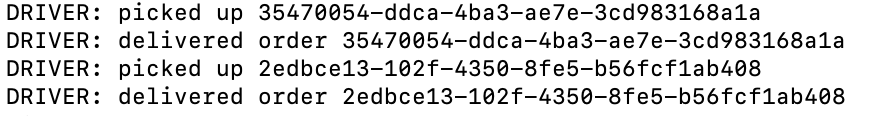

# caps-driver
An event based app that is a socket client for the CAPS socket server app. This app services the drivers, the app listens for broadcasts of when packages need to be delivered and then emits pickup, in-transit and delivered messages to the CAPS system for redirection to the vendors.

## Author: Anne Thorsteinson

**[Tests](https://github.com/AnneThor/caps-driver/actions)**

**[Front End - UNDER CONSTRUCTION](https://parcel-delivery-tracker.herokuapp.com/)**

## Setup

```.env``` requirements:

- ```PORT```
- ```DRIVER_ID```: set the driver id

## Running the App

Currently working on the backend, so there is no front end display yet

- ```npm start```: this will run the app, it will listen for events from the CAPS server app and respond accordingly

- When a driver joins the connection, they join a room that can be associated with the ```DRIVER_ID``` variable allowing them to receive direct messages frmo the CAPS server
- When a driver receives a pickup event from the CAPS server, they respond with an in transit message 
- When a driver received as in transit message from the CAPS server, they respond with a delivered message
- The driver app logs to the console the activity
- 



### Endpoints:

The app runs from the ```/caps``` namespace

## Tests

- Unit Tests: ```npm run test``` testing is complete for listener functions
- Lint Tests: ```npm run lint```

## UML Diagram


